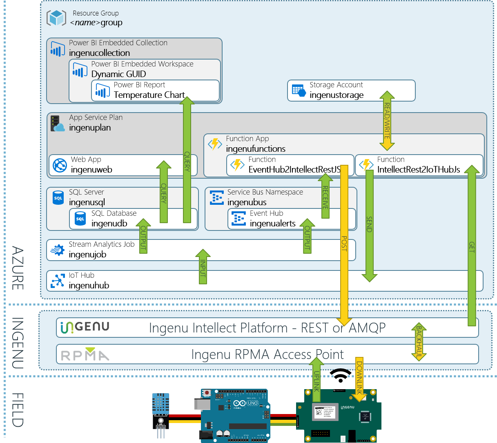

# Ingenu Intellect to Azure Integration

Ingenu [ingenu.com](http://ingenu.com) provides low power wide area wireless access to IoT Devices.  With significant coverage in the US today, and an aggressive growth schedule Ingenu's "[Machine Network](http://www.ingenu.com/technology/machine-network/)" is an attractive choice for your IoT connectivity needs.  The heart of Ingenu's capabilities is in their [RPMA wireless technology](http://www.ingenu.com/technology/rpma/).  Devices communicate with Ingenu's network using RPMA radios.  The data then makes it's way to Ingenu's [Intellect](http://www.ingenu.com/technology/machine-network/intellect/) platform where it is available for retrieval by the customer via either a REST API, or the AMQP protocol.

You can read a technical case study that gives an overview of the project here: [Ingenu2Azure Technical Case Study](https://aka.ms/ingenu2azurecasestudy)

The code in this project is an example of how you can consume device message data from the Ingenu Intellect REST API, and forward that on into an Azure IoT Hub.  From there the data can be consumed by the full stack of Azure Services.  In this example, we use a combination of :

- [Azure IoT Hub](https://azure.microsoft.com/en-us/services/iot-hub/)
- [Azure Stream Analytics](https://azure.microsoft.com/en-us/services/stream-analytics/)
- [Azure SQL Database](https://azure.microsoft.com/en-us/services/sql-database/)
- [Azure Event Hubs](https://azure.microsoft.com/en-us/services/event-hubs/)
- [Azure Functions](https://azure.microsoft.com/en-us/services/functions/)
- [Azure Web Apps](https://azure.microsoft.com/en-us/services/app-service/web/)
- [Azure Power BI Embedded](https://azure.microsoft.com/en-us/services/power-bi-embedded/)

